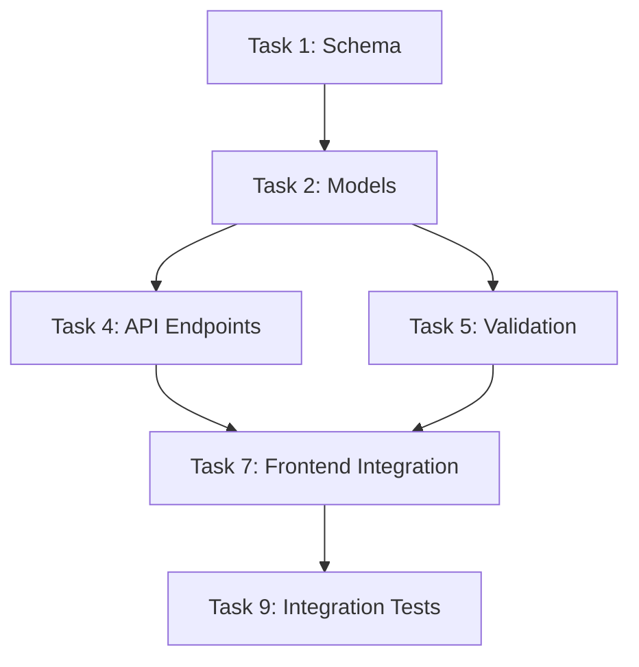

# Create Tasks

Break a technical specification into implementable, prioritized tasks. Creates a task list that can be executed directly or delegated via `/orchestrate-tasks`.

## Important Guidelines

- **Always use AskUserQuestion tool** when asking the user anything
- **Tasks must be atomic** — Each task should be completable in one focused session
- **Dependency-aware** — Order tasks so dependencies are resolved first
- **Agent-assignable** — Each task should map to a clear agent specialization

## Prerequisites

A spec folder must exist with at least `spec.md` from a prior `/write-spec` run:
```
workflow/specs/{timestamp}-{feature-slug}/
├── shape.md
├── spec.md       (REQUIRED)
├── references.md
└── standards.md
```

If no `spec.md` exists, tell the user:
```
No technical specification found. Run /write-spec first to create the technical spec, then run /create-tasks to break it into tasks.
```

## Process

### Step 1: Locate the Spec

Same as `/write-spec` Step 1 — find the target spec folder.

### Step 2: Read the Specification

Read `spec.md` completely. Also read:
- `shape.md` for scope context
- `standards.md` for compliance requirements
- `workflow/product/architecture.md` for architectural constraints

### Step 3: Identify Task Groups

Analyze the spec and identify logical task groups. Each group represents a cohesive unit of work.

Use AskUserQuestion to present the proposed structure:

```
I've analyzed the spec and identified these task groups:

1. **Data Layer** (3 tasks) — Schema, models, migrations
2. **API Layer** (4 tasks) — Endpoints, validation, serialization
3. **Frontend** (3 tasks) — Components, state, integration
4. **Testing** (2 tasks) — Unit tests, integration tests

Does this breakdown look right? (yes / adjust: [your changes])
```

### Step 4: Generate Task List

Create `tasks.md` in the spec folder with this structure:

```markdown
# Task List: {Feature Name}

**Spec:** ./spec.md
**Created:** {date}
**Status:** Ready for implementation

## Summary

| Group | Tasks | Estimated Effort | Agent |
|-------|-------|-------------------|-------|
| Data Layer | 3 | [S/M/L] | backend |
| API Layer | 4 | [S/M/L] | backend |
| Frontend | 3 | [S/M/L] | frontend |
| Testing | 2 | [S/M/L] | testing |

## Dependency Graph



## Task Groups

### Group 1: Data Layer

#### Task 1.1: {Task Title}

- **Description:** [What to implement]
- **Agent:** [Which agent type: backend/frontend/devops/security]
- **Dependencies:** None (or list task IDs)
- **Effort:** S/M/L
- **Standards:** [Which standards apply]
- **Acceptance Criteria:**
  - [ ] [Criterion 1]
  - [ ] [Criterion 2]
- **Files to create/modify:**
  - `path/to/file.ext` — [What to do]

#### Task 1.2: {Task Title}

...

### Group 2: API Layer

#### Task 2.1: {Task Title}

...

### Group N: Testing & Verification

#### Task N.1: Unit Tests

- **Description:** Write unit tests for [components]
- **Agent:** testing
- **Dependencies:** [All implementation tasks]
- **Acceptance Criteria:**
  - [ ] Coverage >= 80% for new code
  - [ ] All edge cases from spec covered
  - [ ] Error scenarios tested

#### Task N.2: Integration Tests

- **Description:** End-to-end verification
- **Agent:** testing
- **Dependencies:** [All prior tasks]
- **Acceptance Criteria:**
  - [ ] Happy path works end-to-end
  - [ ] Error handling verified
  - [ ] Performance within bounds
```

### Step 5: Determine Execution Order

Calculate the critical path and present it:

```
## Execution Order (Critical Path)

Phase 1 (parallel):
  - Task 1.1: Schema
  - Task 1.2: Types/Interfaces

Phase 2 (after Phase 1):
  - Task 1.3: Models
  - Task 2.1: API scaffolding

Phase 3 (after Phase 2):
  - Task 2.2: Endpoint implementation
  - Task 2.3: Validation

Phase 4 (after Phase 3):
  - Task 3.1: Frontend components
  - Task 3.2: State management

Phase 5 (after Phase 4):
  - Task 4.1: Unit tests
  - Task 4.2: Integration tests
```

### Step 6: Generate orchestration.yml

Create `orchestration.yml` in the spec folder for use by `/orchestrate-tasks`:

```yaml
# Orchestration Configuration for {Feature Name}
# Generated from: ./spec.md
# Date: {date}

feature: {feature-slug}
spec_folder: workflow/specs/{folder-name}/

task_groups:
  - name: data-layer
    agent: backend
    standards:
      - database/migrations
      - global/naming
    tasks:
      - id: "1.1"
        title: Schema
        depends_on: []
      - id: "1.2"
        title: Models
        depends_on: ["1.1"]

  - name: api-layer
    agent: backend
    standards:
      - api/response-format
      - api/error-handling
    tasks:
      - id: "2.1"
        title: API Endpoints
        depends_on: ["1.2"]
      - id: "2.2"
        title: Validation
        depends_on: ["2.1"]

  - name: frontend
    agent: frontend
    standards:
      - frontend/components
      - global/naming
    tasks:
      - id: "3.1"
        title: Components
        depends_on: ["2.1"]
      - id: "3.2"
        title: Integration
        depends_on: ["3.1", "2.2"]

  - name: testing
    agent: testing
    standards:
      - testing/coverage
    tasks:
      - id: "4.1"
        title: Unit Tests
        depends_on: ["2.2", "3.2"]
      - id: "4.2"
        title: Integration Tests
        depends_on: ["4.1"]

execution_phases:
  - phase: 1
    parallel: ["1.1"]
  - phase: 2
    parallel: ["1.2"]
  - phase: 3
    parallel: ["2.1", "2.2"]
  - phase: 4
    parallel: ["3.1", "3.2"]
  - phase: 5
    parallel: ["4.1", "4.2"]

agent_mapping:
  # Maps abstract task types to concrete agents in .claude/agents/
  # Must align with workflow/orchestration.yml default_mapping
  backend: debug
  frontend: debug
  testing: debug
  database: debug
  security: security
  infrastructure: devops
  ci_cd: devops
  architecture: architect
  documentation: researcher
  review: architect

quality_gates:
  # Review gates triggered at phase transitions
  # Security review: after API/auth phases
  # Architecture review: after major design phases
  after_api_layer:
    - agent: security
      check: input_validation, auth, gdpr
    - agent: architect
      check: api_consistency, naming
  after_frontend:
    - agent: architect
      check: component_boundaries, patterns
  after_testing:
    - agent: security
      check: no_secrets_in_tests
```

### Step 7: Confirm with User

Use AskUserQuestion:

```
Task breakdown complete:

  workflow/specs/{folder-name}/tasks.md        — {N} tasks in {M} groups
  workflow/specs/{folder-name}/orchestration.yml — Delegation config

Execution plan: {X} phases, estimated effort: [S/M/L/XL]

Options:
1. Approve — Ready for /orchestrate-tasks
2. Adjust tasks — [Tell me what to change]
3. Start implementing manually — [Pick a task to start with]
```

### Step 8: Save and Confirm

After approval, save both files and output:

```
Task creation complete:

  workflow/specs/{folder-name}/tasks.md
  workflow/specs/{folder-name}/orchestration.yml

Spec folder now contains:
  - shape.md           (requirements & context)
  - spec.md            (technical specification)
  - tasks.md           (implementable tasks) [NEW]
  - orchestration.yml  (delegation config) [NEW]
  - references.md      (similar implementations)
  - standards.md       (applicable standards)

Next steps:
  - Run /orchestrate-tasks to delegate tasks to specialized agents
  - Or pick a task and start implementing manually
```

## Task Sizing Guide

| Size | Description | Typical Scope |
|------|-------------|---------------|
| S | Small | Single file change, simple logic |
| M | Medium | 2-4 files, moderate complexity |
| L | Large | 5+ files, complex logic, multiple concerns |

## Agent Type Guide

Maps abstract task types to the 7 agents in `.claude/agents/`:

| Agent Type | Maps To | Typical Tasks |
|------------|---------|---------------|
| backend | debug | APIs, models, business logic |
| frontend | debug | Components, state, UI integration |
| testing | debug | Unit tests, integration tests |
| database | debug | Schema, migrations, queries |
| security | security | Auth review, OWASP audits, input validation |
| infrastructure | devops | Docker, K8s, Terraform, IaC |
| ci_cd | devops | CI/CD pipelines, deployment workflows |
| architecture | architect | ADRs, design decisions, API reviews |
| documentation | researcher | Analysis reports, pattern documentation |
| review | architect | Architectural consistency, API review |
| explanation | ask | Concept clarification, code walkthroughs |

## Tips

- **Prefer more smaller tasks** over fewer large tasks — easier to parallelize
- **Include a testing group** always — even if the spec doesn't mention tests
- **Dependencies should be minimal** — Over-depending creates bottlenecks
- **Agent assignment informs delegation** — Map to your actual agent capabilities
- **Tasks are not permanent** — They can be split, merged, or reordered during implementation
