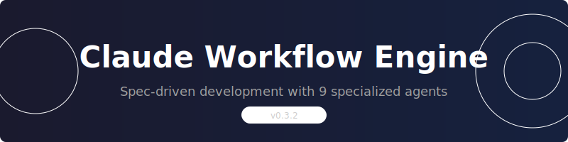
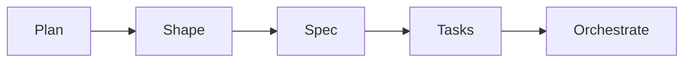
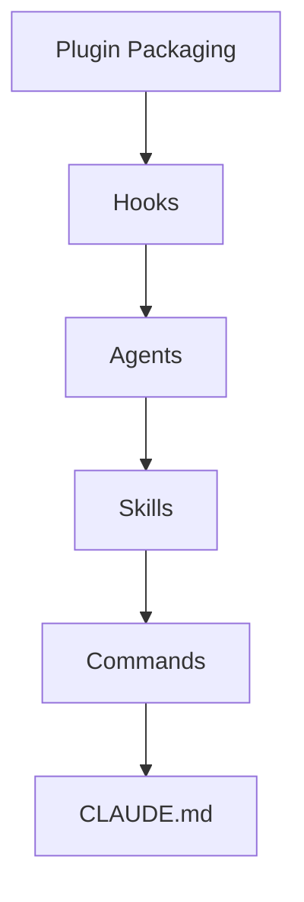

<p align="center">
  <picture>
    <source media="(prefers-color-scheme: dark)" srcset="assets/hero-light.svg">
    <source media="(prefers-color-scheme: light)" srcset="assets/hero-dark.svg">
    
  </picture>
</p>

<p align="center">
  A multi-agent workflow system for Claude Code.<br>
  9 specialized agents. Spec-driven development. Context isolation.
</p>

<p align="center">
  <a href="docs/en/getting-started.md">Getting Started</a> ·
  <a href="docs/en/">Documentation</a> ·
  <a href="docs/">Deutsch</a>
</p>

---

## Features

- **Discover Standards** — Auto-inject relevant conventions based on task context
- **Shape Specs** — 5-phase workflow from idea to implementation
- **Delegate Tasks** — 9 specialized agents handle different concerns
- **Learn Patterns** — NaNo observes your workflow and suggests improvements
- **Save Tokens** — TOON format reduces API response size by ~40%
- **Stay Private** — 100% local, GDPR-compliant, no cloud sync

---

## Quick Start

```bash
/workflow:smart-workflow     # Auto-detect phase, guided workflow
/workflow:quick              # Fast 3-step for MVPs
/workflow:help               # Contextual help
```

---

## Agents

| Agent | Expertise | Access |
|-------|-----------|--------|
| architect | System Design, ADRs, API Review | Read-only |
| builder | Implementation, Bug Fixes | Full |
| devops | CI/CD, Docker, Kubernetes | Full |
| explainer | Explanations, Tutorials | Read-only |
| guide | NaNo Evolution, Pattern-to-Standards | Read-only |
| innovator | Brainstorming, Creative Solutions | Read-only |
| quality | Testing, Coverage, Quality Gates | Read-only |
| researcher | Analysis, Documentation | Read-only |
| security | OWASP Audits, CVE Scanning | Restricted |

---

## Workflow



| Phase | Command | Output |
|-------|---------|--------|
| 1. Plan | `/workflow:plan-product` | Product vision, goals, constraints |
| 2. Shape | `/workflow:shape-spec` | Requirements, references |
| 3. Spec | `/workflow:write-spec` | Technical specification |
| 4. Tasks | `/workflow:create-tasks` | Implementable task list |
| 5. Build | `/workflow:orchestrate-tasks` | Delegated agent work |

---

## Architecture



| Layer | Component | Count |
|-------|-----------|-------|
| 6 | Plugin Packaging | 1 bundle |
| 5 | Hooks | 5 event handlers |
| 4 | Agents | 9 specialists |
| 3 | Skills | 13 context skills |
| 2 | Commands | 23 slash commands |
| 1 | CLAUDE.md | Project instructions |

---

## Installation

```bash
# Clone
git clone https://github.com/LL4nc33/claude-workflow-engine.git
cd claude-workflow-engine

# Build CLI
cd cli && npm install && npm run build && cd ..

# Install to your project
./cli/dist/index.js install /path/to/your/project
```

Profiles: `default`, `node`, `python`, `rust`

```bash
./cli/dist/index.js install --profile node /path/to/project
```

---

## Privacy

- **100% Local** — No cloud sync, data stays on your machine
- **GDPR Ready** — EU data residency compliant
- **No PII** — No personal data in standards or specs
- **Gitignored** — Sensitive configs in `*.local.md` files

---

## Documentation

| Document | Description |
|----------|-------------|
| [Getting Started](docs/en/getting-started.md) | Installation and basics |
| [Workflow Guide](docs/en/workflow.md) | 5-phase workflow details |
| [Agents](docs/en/agents.md) | All 9 agents explained |
| [Standards](docs/en/standards.md) | Standards system |
| [Configuration](docs/en/configuration.md) | Settings and customization |

Deutsche Dokumentation: [docs/](docs/)

---

## License

MIT License — see [LICENSE](LICENSE)

---

<p align="center">
  <sub>Inspired by <a href="https://github.com/11rl/agent-os">agent-os</a></sub>
</p>
