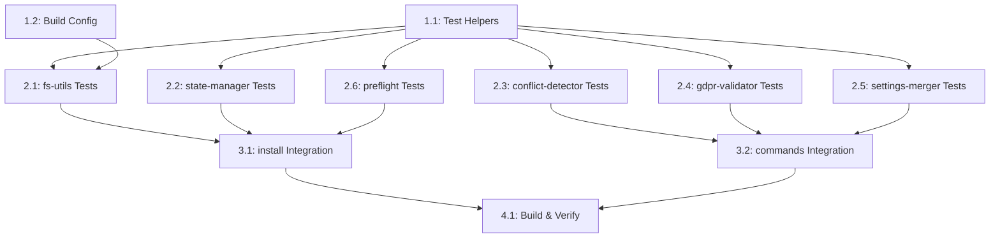

# Task List: CLI Unit & Integration Tests

**Spec:** ./spec.md
**Created:** 2026-01-23
**Status:** Completed (174/174 tests passing)

## Summary

| Group | Tasks | Effort | Agent | Status |
|-------|-------|--------|-------|--------|
| Infrastructure | 2 | S | builder | Done |
| Unit Tests — Libs | 6 | M | builder | Done |
| Integration Tests | 2 | M | builder | Done |
| Verification | 1 | S | builder | Done |

## Dependency Graph



## Task Groups

### Group 1: Infrastructure

#### Task 1.1: Test Helpers [DONE]

- **Description:** Create shared test utilities (temp dirs, mock logger, project setup)
- **Agent:** builder
- **Dependencies:** None
- **Effort:** S
- **Standards:** testing/coverage
- **Acceptance Criteria:**
  - [x] `createTempDir()` creates isolated temp dir
  - [x] `cleanupTempDir()` removes dir recursively
  - [x] `createMockLogger()` returns silent logger
  - [x] `setupTestProject()` creates full project structure
  - [x] `writeTestFile()` handles parent dir creation
- **Files created:**
  - `cli/src/tests/helpers.ts`

#### Task 1.2: Build Configuration [DONE]

- **Description:** Update package.json scripts and verify tsconfig includes tests
- **Agent:** builder
- **Dependencies:** None
- **Effort:** S
- **Acceptance Criteria:**
  - [x] `npm test` runs all test files
  - [x] `npm run test:watch` available for development
  - [x] Tests compile alongside main source
- **Files modified:**
  - `cli/package.json` — Added test:watch, fixed test glob pattern

---

### Group 2: Unit Tests — Libs

#### Task 2.1: fs-utils Tests [DONE]

- **Description:** Test all 14 exported filesystem utility functions
- **Agent:** builder
- **Dependencies:** 1.1, 1.2
- **Effort:** M
- **Standards:** testing/coverage (AAA-Pattern)
- **Acceptance Criteria:**
  - [x] 32 tests covering all 14 functions
  - [x] Positive and negative cases
  - [x] Edge cases (empty files, non-existing paths, nested dirs)
- **Files created:**
  - `cli/src/tests/fs-utils.test.ts`

#### Task 2.2: state-manager Tests [DONE]

- **Description:** Test StateManager class (init, state, integrity, backups, rollback)
- **Agent:** builder
- **Dependencies:** 1.1
- **Effort:** M
- **Standards:** testing/coverage
- **Acceptance Criteria:**
  - [x] 22 tests covering 10 method groups
  - [x] State persistence verified
  - [x] Checksum calculation tested
  - [x] Corrupted state handled
- **Files created:**
  - `cli/src/tests/state-manager.test.ts`

#### Task 2.3: conflict-detector Tests [DONE]

- **Description:** Test ConflictDetector class (file conflicts, command conflicts, permissions)
- **Agent:** builder
- **Dependencies:** 1.1
- **Effort:** M
- **Standards:** testing/coverage
- **Acceptance Criteria:**
  - [x] 14 tests covering detect() and runChecks()
  - [x] File conflict detection (modified, exists-only)
  - [x] Command namespace collision detection
  - [x] Write permission verification
- **Files created:**
  - `cli/src/tests/conflict-detector.test.ts`

#### Task 2.4: gdpr-validator Tests [DONE]

- **Description:** Test GDPRValidator class (gitignore, PII scan, local config, auto-fix)
- **Agent:** builder
- **Dependencies:** 1.1
- **Effort:** M
- **Standards:** testing/coverage
- **Acceptance Criteria:**
  - [x] 22 tests covering validate(), autoFix(), runChecks()
  - [x] PII detection (email, credit card, credentials)
  - [x] Gitignore pattern coverage logic
  - [x] Auto-fix adds missing patterns
  - [x] Comments/examples skipped correctly
- **Files created:**
  - `cli/src/tests/gdpr-validator.test.ts`

#### Task 2.5: settings-merger Tests [DONE]

- **Description:** Test SettingsMerger class (generate, merge, validate per profile)
- **Agent:** builder
- **Dependencies:** 1.1
- **Effort:** M
- **Standards:** testing/coverage
- **Acceptance Criteria:**
  - [x] 20 tests covering generate(), merge(), validateExisting()
  - [x] All 4 profiles tested (default, node, python, rust)
  - [x] DevOps and security permission add-ons tested
  - [x] Non-destructive merge verified
  - [x] Dry-run mode verified
- **Files created:**
  - `cli/src/tests/settings-merger.test.ts`

#### Task 2.6: preflight Tests [DONE]

- **Description:** Test PreFlightChecker class (environment, platform, target path)
- **Agent:** builder
- **Dependencies:** 1.1
- **Effort:** M
- **Standards:** testing/coverage
- **Acceptance Criteria:**
  - [x] 14 tests covering run() and sub-checks
  - [x] Node version check (pass for >= 18)
  - [x] Git availability detection
  - [x] Target path validation (exists, is-dir, git-repo)
  - [x] Force flag overrides errors
- **Files created:**
  - `cli/src/tests/preflight.test.ts`

---

### Group 3: Integration Tests

#### Task 3.1: Install Command Integration [DONE]

- **Description:** End-to-end install workflow in isolated temp directories
- **Agent:** builder
- **Dependencies:** 2.1, 2.2, 2.6
- **Effort:** M
- **Standards:** testing/coverage
- **Acceptance Criteria:**
  - [x] 10 tests covering full install flow
  - [x] StateManager integration verified
  - [x] SettingsMerger integration verified
  - [x] GDPRValidator auto-fix verified
  - [x] Skip/force behavior tested
  - [x] Gitignore pattern creation tested
- **Files created:**
  - `cli/src/tests/install.test.ts`

#### Task 3.2: Commands Integration (health, status, check, resolve) [DONE]

- **Description:** Integration tests for remaining 4 commands
- **Agent:** builder
- **Dependencies:** 2.3, 2.4, 2.5
- **Effort:** M
- **Standards:** testing/coverage
- **Acceptance Criteria:**
  - [x] 40 tests across 4 command areas
  - [x] Health: core files, integrity, settings, GDPR, directory structure
  - [x] Status: not-installed, post-install info, integrity stats, backups
  - [x] Check: conflicts, GDPR patterns, auto-fix, permissions
  - [x] Resolve: backup before resolution, overwrite, GDPR fix
- **Files created:**
  - `cli/src/tests/commands.test.ts`

---

### Group 4: Verification

#### Task 4.1: Build & Run All Tests [DONE]

- **Description:** Compile and verify all tests pass
- **Agent:** builder
- **Dependencies:** 3.1, 3.2
- **Effort:** S
- **Acceptance Criteria:**
  - [x] `npm run build` compiles without errors
  - [x] `npm test` runs 174 tests
  - [x] All 174 tests pass (0 failures)
  - [x] Execution time < 2s
- **Verification Output:**
  ```
  # tests 174
  # suites 71
  # pass 174
  # fail 0
  # duration_ms ~1150
  ```

---

## Execution Order (Completed)

Phase 1 (parallel):
  - Task 1.1: Test Helpers
  - Task 1.2: Build Config

Phase 2 (after Phase 1, parallel):
  - Task 2.1: fs-utils Tests
  - Task 2.2: state-manager Tests
  - Task 2.3: conflict-detector Tests
  - Task 2.4: gdpr-validator Tests
  - Task 2.5: settings-merger Tests
  - Task 2.6: preflight Tests

Phase 3 (after Phase 2, parallel):
  - Task 3.1: install Integration
  - Task 3.2: commands Integration

Phase 4 (after Phase 3):
  - Task 4.1: Build & Verify
