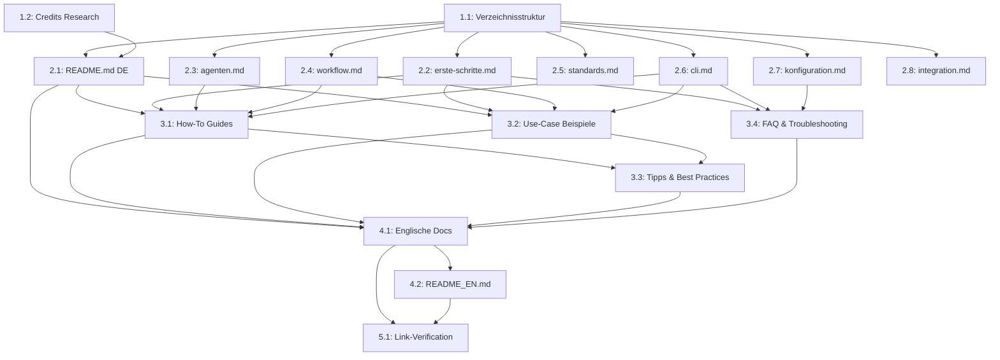

# Task List: Documentation Overhaul

**Spec:** ./spec.md
**Created:** 2026-01-23
**Status:** Ready for implementation

## Summary

| Group | Tasks | Effort | Agent |
|-------|-------|--------|-------|
| Infrastructure | 2 | S | debug |
| Core Docs (DE) | 8 | L | debug |
| Neue Inhalte (DE) | 4 | L | debug |
| Englische Version | 2 | M | debug |
| Verification | 1 | S | debug |

## Dependency Graph

## Task Groups

### Group 1: Infrastructure

#### Task 1.1: Verzeichnisstruktur erstellen [TODO]

- **Description:** Neue Ordnerstruktur fuer die Dokumentation anlegen: docs/how-to/, docs/beispiele/, docs/en/, docs/en/how-to/, docs/en/examples/
- **Agent:** debug
- **Dependencies:** None
- **Effort:** S
- **Acceptance Criteria:**
  - [ ] docs/how-to/ existiert
  - [ ] docs/beispiele/ existiert
  - [ ] docs/en/ existiert
  - [ ] docs/en/how-to/ existiert
  - [ ] docs/en/examples/ existiert
  - [ ] Alte englische Docs bleiben vorerst bestehen (werden spaeter ersetzt)
- **Files to create:**
  - `docs/how-to/.gitkeep`
  - `docs/beispiele/.gitkeep`
  - `docs/en/.gitkeep`
  - `docs/en/how-to/.gitkeep`
  - `docs/en/examples/.gitkeep`

#### Task 1.2: Credits Research [TODO]

- **Description:** Die 4 Inspirationsprojekte recherchieren und kurze Beschreibungen formulieren, was genau wir von jedem uebernommen haben. URLs verifizieren.
- **Agent:** debug
- **Dependencies:** None
- **Effort:** S
- **Acceptance Criteria:**
  - [ ] Alle 4 URLs geprueft und gueltig
  - [ ] Fuer jedes Projekt: 2-3 Saetze was wir davon inspiriert/uebernommen haben
  - [ ] Ergebnis in einer Referenzdatei gespeichert fuer Wiederverwendung
- **Files to create:**
  - `workflow/specs/2026-01-23-documentation-overhaul/credits-research.md`

---

### Group 2: Core Docs (Deutsch)

#### Task 2.1: README.md (Deutsch) [TODO]

- **Description:** README.md komplett neu schreiben auf Deutsch. Professionell-technisch mit Tutorial-Elementen. Enthalt: Teaser, Features, Schnellstart, Architektur, Projektstruktur, korrekte Credits.
- **Agent:** debug
- **Dependencies:** 1.1, 1.2
- **Effort:** M
- **Standards:** global/naming
- **Acceptance Criteria:**
  - [ ] Komplett auf Deutsch (technische Begriffe bleiben Englisch)
  - [ ] Features-Uebersicht mit 7 Agenten, 5-Phasen Workflow, Standards, CLI
  - [ ] Schnellstart Tutorial (Clone, Start, erster Workflow)
  - [ ] Architektur-Diagramm (3-Schichten + Agenten-Hierarchie)
  - [ ] Korrekte Credits (buildermethods/agent-os, RooCodeInc/Roo-Code, anthropics/claude-code, upstash/context7)
  - [ ] Links zu allen deutschen Docs
  - [ ] Badge fuer Version, License, Claude Code
- **Files to create/modify:**
  - `README.md` — Komplett ersetzen

#### Task 2.2: erste-schritte.md [TODO]

- **Description:** Getting Started Guide auf Deutsch im Tutorial-Stil. Schritt-fuer-Schritt Anleitung von der Installation bis zum ersten erfolgreichen Workflow-Durchlauf.
- **Agent:** debug
- **Dependencies:** 1.1
- **Effort:** M
- **Acceptance Criteria:**
  - [ ] Voraussetzungen klar aufgelistet
  - [ ] Installation (Clone + CLI optional)
  - [ ] Erster Workflow komplett durchgespielt mit erwarteter Ausgabe
  - [ ] Verifikation dass alles funktioniert
  - [ ] Naechste Schritte mit Links
  - [ ] Datenschutz-Hinweis
- **Files to create:**
  - `docs/erste-schritte.md`

#### Task 2.3: agenten.md [TODO]

- **Description:** Agenten-Referenz auf Deutsch. Alle 7 Agenten mit Rolle, Zugang, Tools, Spezialisierungen, Wann-nutzen Beispielen.
- **Agent:** debug
- **Dependencies:** 1.1
- **Effort:** M
- **Acceptance Criteria:**
  - [ ] Alle 7 Agenten dokumentiert
  - [ ] Uebersichtstabelle am Anfang
  - [ ] Zugangsstufen erklaert
  - [ ] Pro Agent: Rolle, Zugang, Tools, Spezialisierungen, Wann nutzen, Kollaborationen
  - [ ] Hierarchie-Diagramm
  - [ ] Praktische Beispiel-Prompts pro Agent
- **Files to create:**
  - `docs/agenten.md`

#### Task 2.4: workflow.md [TODO]

- **Description:** Workflow Guide auf Deutsch. Alle 5 Phasen detailliert mit Beispiel-Interaktionen und erwarteter Ausgabe.
- **Agent:** debug
- **Dependencies:** 1.1
- **Effort:** M
- **Acceptance Criteria:**
  - [ ] Alle 5 Phasen dokumentiert
  - [ ] Uebersichtstabelle
  - [ ] Pro Phase: Command, Zweck, Was passiert, Output, Beispiel-Interaktion
  - [ ] Tipps zum Ueberspringen von Phasen
  - [ ] Quality Gates erklaert
- **Files to create:**
  - `docs/workflow.md` — Ersetzen (bestehende englische Version)

#### Task 2.5: standards.md [TODO]

- **Description:** Standards-System Dokumentation auf Deutsch. 3-Schichten-Modell, Domaenen, Nutzungsarten, Standards schreiben.
- **Agent:** debug
- **Dependencies:** 1.1
- **Effort:** M
- **Acceptance Criteria:**
  - [ ] 3-Schichten-Kontextmodell erklaert
  - [ ] Alle 7 Domaenen und 11 Standards gelistet
  - [ ] 3 Nutzungsarten (Skills, Injection, Manuell)
  - [ ] Anleitung: Gute Standards schreiben
  - [ ] Standards-Management Commands
- **Files to create:**
  - `docs/standards.md` — Ersetzen

#### Task 2.6: cli.md [TODO]

- **Description:** CLI-Referenz auf Deutsch. Alle Commands mit Optionen, Beispielen und erwarteter Ausgabe.
- **Agent:** debug
- **Dependencies:** 1.1
- **Effort:** M
- **Acceptance Criteria:**
  - [ ] Alle 8 Commands dokumentiert
  - [ ] Pro Command: Syntax, Optionen-Tabelle, Beispiele mit Ausgabe
  - [ ] Exit-Codes
  - [ ] Datenschutz-Hinweis
  - [ ] Installation (npm build + link)
- **Files to create:**
  - `docs/cli.md` — Ersetzen

#### Task 2.7: konfiguration.md [TODO]

- **Description:** Konfigurationsreferenz auf Deutsch. Alle Config-Dateien mit vollstaendiger Referenz und Anpassungs-Beispielen.
- **Agent:** debug
- **Dependencies:** 1.1
- **Effort:** M
- **Acceptance Criteria:**
  - [ ] Alle 5 Config-Dateien dokumentiert
  - [ ] config.yml: Vollstaendige Referenz mit Kommentaren
  - [ ] orchestration.yml: Phasen, Agents, Standards, Quality Gates
  - [ ] index.yml: Format und Regeln
  - [ ] CLAUDE.md und settings.local.json: Zweck und Inhalt
  - [ ] Haeufige Anpassungen mit Code-Beispielen
- **Files to create:**
  - `docs/konfiguration.md`

#### Task 2.8: integration.md [TODO]

- **Description:** Integrations-Guide auf Deutsch. CLI-basierte und manuelle Installation in bestehende Projekte, Konfliktloesung, Deinstallation.
- **Agent:** debug
- **Dependencies:** 1.1
- **Effort:** M
- **Acceptance Criteria:**
  - [ ] CLI-Installation (empfohlen): Step-by-Step
  - [ ] Manuelle Installation: Step-by-Step
  - [ ] Konfliktloesung pro Typ
  - [ ] Anpassung nach Installation
  - [ ] Deinstallation
  - [ ] Troubleshooting-Abschnitt
- **Files to create:**
  - `docs/integration.md` — Ersetzen

---

### Group 3: Neue Inhalte (Deutsch)

#### Task 3.1: How-To Guides [TODO]

- **Description:** 4 Schritt-fuer-Schritt Anleitungen erstellen: Neues Feature entwickeln, eigenen Agent erstellen, Standards erweitern, CLI Installation.
- **Agent:** debug
- **Dependencies:** 2.1, 2.2, 2.3, 2.4, 2.6
- **Effort:** L
- **Acceptance Criteria:**
  - [ ] neues-feature-entwickeln.md: Kompletter 5-Phasen Durchlauf mit Beispiel-Projekt
  - [ ] eigenen-agent-erstellen.md: Agent-Definition, Registrierung, Test, Best Practices
  - [ ] standards-erweitern.md: Neue Standards erstellen, Index aktualisieren, Skills
  - [ ] cli-installation.md: Build, Dry-Run, Install, Health Check, Troubleshooting
  - [ ] Jeder Guide: Ziel, Voraussetzungen, Steps, Ergebnis, Naechste Schritte
  - [ ] Code-Beispiele mit erwarteter Ausgabe
- **Files to create:**
  - `docs/how-to/neues-feature-entwickeln.md`
  - `docs/how-to/eigenen-agent-erstellen.md`
  - `docs/how-to/standards-erweitern.md`
  - `docs/how-to/cli-installation.md`

#### Task 3.2: Use-Case Beispiele [TODO]

- **Description:** 5 vollstaendige Praxis-Szenarien mit komplettem Workflow-Durchlauf.
- **Agent:** debug
- **Dependencies:** 2.1, 2.2, 2.4, 2.6
- **Effort:** L
- **Acceptance Criteria:**
  - [ ] use-case-api-feature.md: REST API von Idee bis Implementation
  - [ ] use-case-bugfix-workflow.md: Systematisches Debugging mit dem Debug-Agent
  - [ ] use-case-greenfield-projekt.md: Neues Projekt komplett aufsetzen
  - [ ] use-case-cli-integration.md: CLI in bestehendes Node.js Projekt integrieren
  - [ ] use-case-standards-team.md: Team-Standards etablieren und durchsetzen
  - [ ] Jedes Beispiel: Szenario, Loesung, vollstaendiger Durchlauf, Ergebnis, Variationen
  - [ ] Realistische Befehle und Ausgaben
- **Files to create:**
  - `docs/beispiele/use-case-api-feature.md`
  - `docs/beispiele/use-case-bugfix-workflow.md`
  - `docs/beispiele/use-case-greenfield-projekt.md`
  - `docs/beispiele/use-case-cli-integration.md`
  - `docs/beispiele/use-case-standards-team.md`

#### Task 3.3: Tipps & Best Practices [TODO]

- **Description:** Gesammelte Best Practices, Cheat Sheets und Optimierungstipps.
- **Agent:** debug
- **Dependencies:** 3.1, 3.2
- **Effort:** M
- **Acceptance Criteria:**
  - [ ] Agent-Auswahl Cheat Sheet (Tabelle: Situation -> Agent)
  - [ ] Workflow-Abkuerzungen (wann welche Phase ueberspringen)
  - [ ] Standards-Design Regeln (Do/Don't)
  - [ ] Haeufige Fehler und Loesungen
  - [ ] Performance-Tipps (Context-Window, Token-Optimierung)
  - [ ] Orchestrierungs-Strategien
- **Files to create:**
  - `docs/tipps.md`

#### Task 3.4: FAQ & Troubleshooting [TODO]

- **Description:** Mindestens 15 haeufige Fragen mit ausfuehrlichen Antworten, kategorisiert nach Themenbereich.
- **Agent:** debug
- **Dependencies:** 2.2, 2.6, 2.7
- **Effort:** M
- **Acceptance Criteria:**
  - [ ] Mindestens 15 Fragen
  - [ ] Kategorien: Setup, Workflow, Agents, Standards, CLI, Troubleshooting
  - [ ] Jede Antwort mit konkretem Loesungsweg
  - [ ] Code-Beispiele wo relevant
  - [ ] Links zu detaillierteren Docs
- **Files to create:**
  - `docs/faq.md`

---

### Group 4: Englische Version

#### Task 4.1: Englische Docs [TODO]

- **Description:** Alle deutschen Docs ins Englische uebersetzen und unter docs/en/ ablegen.
- **Agent:** debug
- **Dependencies:** 2.1, 3.1, 3.2, 3.3, 3.4
- **Effort:** L
- **Acceptance Criteria:**
  - [ ] Alle 7 Core-Docs auf Englisch unter docs/en/
  - [ ] Alle 4 How-Tos auf Englisch unter docs/en/how-to/
  - [ ] Alle 5 Use-Cases auf Englisch unter docs/en/examples/
  - [ ] tipps.md und faq.md auf Englisch unter docs/en/
  - [ ] Interne Links angepasst (relative Pfade innerhalb docs/en/)
  - [ ] Professionelle Uebersetzung (kein Google Translate Stil)
- **Files to create:**
  - `docs/en/getting-started.md`
  - `docs/en/agents.md`
  - `docs/en/workflow.md`
  - `docs/en/standards.md`
  - `docs/en/cli.md`
  - `docs/en/configuration.md`
  - `docs/en/integration.md`
  - `docs/en/how-to/develop-new-feature.md`
  - `docs/en/how-to/create-custom-agent.md`
  - `docs/en/how-to/extend-standards.md`
  - `docs/en/how-to/cli-installation.md`
  - `docs/en/examples/use-case-api-feature.md`
  - `docs/en/examples/use-case-bugfix-workflow.md`
  - `docs/en/examples/use-case-greenfield-project.md`
  - `docs/en/examples/use-case-cli-integration.md`
  - `docs/en/examples/use-case-team-standards.md`
  - `docs/en/tips.md`
  - `docs/en/faq.md`

#### Task 4.2: README_EN.md [TODO]

- **Description:** Englische Version der README erstellen.
- **Agent:** debug
- **Dependencies:** 4.1
- **Effort:** M
- **Acceptance Criteria:**
  - [ ] Inhaltlich identisch zur deutschen README
  - [ ] Links zeigen auf docs/en/ statt docs/
  - [ ] Professionelles Englisch
  - [ ] Credits identisch
- **Files to create:**
  - `README_EN.md`

---

### Group 5: Verification

#### Task 5.1: Link-Verification & Cleanup [TODO]

- **Description:** Alle internen Links pruefen, alte englische Docs entfernen, Konsistenz sicherstellen.
- **Agent:** debug
- **Dependencies:** 4.1, 4.2
- **Effort:** S
- **Acceptance Criteria:**
  - [ ] Alle relativen Links in deutschen Docs funktionieren
  - [ ] Alle relativen Links in englischen Docs funktionieren
  - [ ] Alte docs/ Dateien (getting-started.md, agents.md, configuration.md) entfernt
  - [ ] Keine orphaned Dateien
  - [ ] README verlinkt korrekt auf alle Docs
  - [ ] README_EN verlinkt korrekt auf docs/en/
- **Files to modify:**
  - Alle Docs (Link-Fixes falls noetig)
- **Files to delete:**
  - `docs/getting-started.md` (ersetzt durch erste-schritte.md)
  - `docs/agents.md` (ersetzt durch agenten.md)
  - `docs/configuration.md` (ersetzt durch konfiguration.md)

---

## Execution Order

Phase 1 (parallel):
  - Task 1.1: Verzeichnisstruktur
  - Task 1.2: Credits Research

Phase 2 (after Phase 1, parallel):
  - Task 2.1: README.md DE
  - Task 2.2: erste-schritte.md
  - Task 2.3: agenten.md
  - Task 2.4: workflow.md
  - Task 2.5: standards.md
  - Task 2.6: cli.md
  - Task 2.7: konfiguration.md
  - Task 2.8: integration.md

Phase 3 (after Phase 2, parallel):
  - Task 3.1: How-To Guides
  - Task 3.2: Use-Case Beispiele
  - Task 3.4: FAQ

Phase 4 (after Phase 3):
  - Task 3.3: Tipps & Best Practices

Phase 5 (after Phase 4, parallel):
  - Task 4.1: Englische Docs
  - Task 4.2: README_EN.md

Phase 6 (after Phase 5):
  - Task 5.1: Link-Verification & Cleanup
