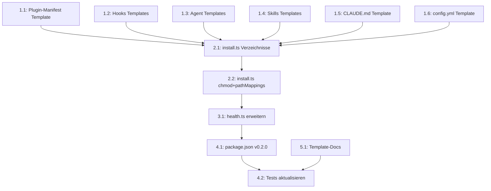

# Task List: CLI Template Sync mit 6-Schichten-Plugin-Architektur

**Spec:** Abgleich Root-Projekt vs. CLI-Templates (aus Exploration)
**Created:** 2026-01-24
**Status:** Ready for implementation

## Summary

| Group | Tasks | Effort | Agent |
|-------|-------|--------|-------|
| Template-Dateien | 6 | M | debug |
| CLI-Code (install.ts) | 2 | M | debug |
| CLI-Code (health.ts) | 1 | S | debug |
| CLI Meta & Tests | 2 | S | debug |
| Template-Docs | 1 | M | debug |

**Total: 12 Tasks in 5 Gruppen**

## Dependency Graph



## Task Groups

### Group 1: Template-Dateien synchronisieren

#### Task 1.1: Plugin-Manifest Template erstellen

- **Description:** `.claude-plugin/plugin.json` als Template in `cli/templates/base/` hinzufügen
- **Agent:** debug
- **Dependencies:** None
- **Effort:** S
- **Acceptance Criteria:**
  - [ ] `cli/templates/base/.claude-plugin/plugin.json` existiert
  - [ ] Inhalt identisch mit Root `.claude-plugin/plugin.json`
  - [ ] Version 0.2.0 im Template
- **Files to create:**
  - `cli/templates/base/.claude-plugin/plugin.json`

#### Task 1.2: Hook-Templates erstellen

- **Description:** Alle Hook-Dateien als Templates in `cli/templates/base/hooks/` hinzufügen
- **Agent:** debug
- **Dependencies:** None
- **Effort:** S
- **Acceptance Criteria:**
  - [ ] `cli/templates/base/hooks/hooks.json` existiert
  - [ ] `cli/templates/base/hooks/scripts/common.sh` existiert
  - [ ] `cli/templates/base/hooks/scripts/session-start.sh` existiert
  - [ ] `cli/templates/base/hooks/scripts/pre-write-validate.sh` existiert
  - [ ] `cli/templates/base/hooks/scripts/post-write-log.sh` existiert
  - [ ] Alle Scripts verwenden `${CLAUDE_PLUGIN_ROOT}` Pfade
  - [ ] Inhalt identisch mit Root `hooks/`
- **Files to create:**
  - `cli/templates/base/hooks/hooks.json`
  - `cli/templates/base/hooks/scripts/common.sh`
  - `cli/templates/base/hooks/scripts/session-start.sh`
  - `cli/templates/base/hooks/scripts/pre-write-validate.sh`
  - `cli/templates/base/hooks/scripts/post-write-log.sh`

#### Task 1.3: Agent-Templates aktualisieren

- **Description:** 6 Agent-Templates mit MCP-Tool-Referenzen und Usage-Sections aktualisieren (devops bleibt unverändert)
- **Agent:** debug
- **Dependencies:** None
- **Effort:** M
- **Acceptance Criteria:**
  - [ ] architect.md hat Serena MCP-Tools im Frontmatter + MCP Usage Section
  - [ ] ask.md hat Serena MCP-Tools
  - [ ] debug.md hat Serena MCP-Tools
  - [ ] researcher.md hat Serena MCP-Tools
  - [ ] orchestrator.md hat Greptile MCP-Tools
  - [ ] security.md hat Greptile MCP-Tools
  - [ ] devops.md bleibt unverändert
  - [ ] Template-Agents identisch mit Root `.claude/agents/`
- **Files to modify:**
  - `cli/templates/base/.claude-agents/architect.md`
  - `cli/templates/base/.claude-agents/ask.md`
  - `cli/templates/base/.claude-agents/debug.md`
  - `cli/templates/base/.claude-agents/researcher.md`
  - `cli/templates/base/.claude-agents/orchestrator.md`
  - `cli/templates/base/.claude-agents/security.md`

#### Task 1.4: Neue Skill-Templates erstellen

- **Description:** 3 neue Plugin-Skills als Templates hinzufügen
- **Agent:** debug
- **Dependencies:** None
- **Effort:** S
- **Acceptance Criteria:**
  - [ ] `cli/templates/base/.claude-skills/workflow/mcp-usage/SKILL.md` existiert
  - [ ] `cli/templates/base/.claude-skills/workflow/hook-patterns/SKILL.md` existiert
  - [ ] `cli/templates/base/.claude-skills/workflow/plugin-config/SKILL.md` existiert
  - [ ] Inhalt identisch mit Root `.claude/skills/workflow/`
- **Files to create:**
  - `cli/templates/base/.claude-skills/workflow/mcp-usage/SKILL.md`
  - `cli/templates/base/.claude-skills/workflow/hook-patterns/SKILL.md`
  - `cli/templates/base/.claude-skills/workflow/plugin-config/SKILL.md`

#### Task 1.5: CLAUDE.md Template aktualisieren

- **Description:** Template-CLAUDE.md um 6-Layer-Architektur, MCP-Tools, Hooks und Recommended MCP Servers erweitern
- **Agent:** debug
- **Dependencies:** None
- **Effort:** S
- **Acceptance Criteria:**
  - [ ] Template enthält "Platform Architecture (6 Layers)" mit Diagramm
  - [ ] Template enthält "Available MCP Tools" Tabelle
  - [ ] Template enthält "Hook Behavior" Tabelle
  - [ ] Template enthält "Recommended MCP Servers" Abschnitt
  - [ ] Inhalt identisch mit Root `.claude/CLAUDE.md`
- **Files to modify:**
  - `cli/templates/base/.claude-CLAUDE.md`

#### Task 1.6: config.yml Template aktualisieren

- **Description:** config.yml auf v0.2.0 bumpen und `plugin:` sowie `mcp:` Sektionen hinzufügen
- **Agent:** debug
- **Dependencies:** None
- **Effort:** S
- **Acceptance Criteria:**
  - [ ] Version ist `0.2.0`
  - [ ] `plugin:` Sektion mit Layer-Referenzen vorhanden
  - [ ] `mcp:` Sektion mit recommended_servers vorhanden
  - [ ] Inhalt identisch mit Root `workflow/config.yml`
- **Files to modify:**
  - `cli/templates/base/workflow/config.yml`

---

### Group 2: install.ts erweitern

#### Task 2.1: Neue Verzeichnisse in install.ts

- **Description:** `.claude-plugin`, `hooks`, `hooks/scripts` zu den erstellten Verzeichnissen hinzufügen. Auch in dryRunInstall.
- **Agent:** debug
- **Dependencies:** 1.1, 1.2
- **Effort:** S
- **Acceptance Criteria:**
  - [ ] `dirs` Array enthält `.claude-plugin`, `hooks`, `hooks/scripts`
  - [ ] `dryRunInstall` zeigt die neuen Verzeichnisse
- **Files to modify:**
  - `cli/src/commands/install.ts`

#### Task 2.2: chmod +x und pathMappings in install.ts

- **Description:** Nach dem Kopieren der Hook-Scripts `chmod +x` ausführen. pathMappings ggf. erweitern falls nötig (hooks/ und .claude-plugin/ haben keine Dot-Prefix-Probleme, sollten direkt kopiert werden).
- **Agent:** debug
- **Dependencies:** 2.1
- **Effort:** M
- **Standards:** WSL2-Kompatibilitaet beachten
- **Acceptance Criteria:**
  - [ ] Nach Installation sind alle `hooks/scripts/*.sh` executable (mode 755)
  - [ ] `fs.chmodSync(dest, 0o755)` für `.sh`-Dateien
  - [ ] Funktioniert auf Linux und WSL2
  - [ ] dryRunInstall zeigt "chmod +x hooks/scripts/*.sh" an
- **Files to modify:**
  - `cli/src/commands/install.ts`

---

### Group 3: health.ts erweitern

#### Task 3.1: Neue Health-Checks

- **Description:** Health-Check um Plugin-Manifest, Hooks und Skills-Anzahl erweitern
- **Agent:** debug
- **Dependencies:** 2.2
- **Effort:** M
- **Acceptance Criteria:**
  - [ ] `coreFiles` enthält `.claude-plugin/plugin.json` (critical: true)
  - [ ] `coreFiles` enthält `hooks/hooks.json` (critical: true)
  - [ ] `requiredDirs` enthält `.claude-plugin`, `hooks`, `hooks/scripts`
  - [ ] Neue Check-Funktion: Hook-Scripts auf executable prüfen
  - [ ] Neue Check-Funktion: Skills-Anzahl prüfen (mind. 10 erwartet)
  - [ ] Auto-Fix: chmod +x für nicht-executable Hook-Scripts
- **Files to modify:**
  - `cli/src/commands/health.ts`

---

### Group 4: CLI Meta & Tests

#### Task 4.1: package.json Version Bump

- **Description:** CLI package.json Version auf 0.2.0 aktualisieren
- **Agent:** debug
- **Dependencies:** 3.1
- **Effort:** S
- **Acceptance Criteria:**
  - [ ] `"version": "0.2.0"` in cli/package.json
- **Files to modify:**
  - `cli/package.json`

#### Task 4.2: Tests aktualisieren

- **Description:** Bestehende Tests auf v0.2.0 aktualisieren, neue Testfälle für Hooks und Plugin hinzufügen
- **Agent:** debug
- **Dependencies:** 4.1
- **Effort:** M
- **Acceptance Criteria:**
  - [ ] Version-Referenzen in Tests auf 0.2.0
  - [ ] Test: Plugin-Manifest wird korrekt kopiert
  - [ ] Test: Hook-Scripts werden kopiert und sind executable
  - [ ] Test: Neue Skills werden kopiert
  - [ ] Test: Health-Check erkennt fehlende Hooks/Plugin
  - [ ] Alle Tests bestehen
- **Files to modify:**
  - `cli/src/tests/install.test.ts`
  - `cli/src/tests/health.test.ts` (falls vorhanden)

---

### Group 5: Template-Docs aktualisieren

#### Task 5.1: Docs im Template synchronisieren

- **Description:** Template-Docs auf aktuelle DE + EN Struktur aktualisieren. Die alten englischen Dateien (agents.md, configuration.md, getting-started.md) ersetzen durch die aktuelle Struktur mit DE-Hauptdateien und EN-Unterordner.
- **Agent:** debug
- **Dependencies:** None
- **Effort:** L
- **Acceptance Criteria:**
  - [ ] Template hat `docs/agenten.md` (aktuell, mit MCP-Tools)
  - [ ] Template hat `docs/erste-schritte.md` (aktuell, mit Hooks/Plugin)
  - [ ] Template hat `docs/konfiguration.md` (aktuell, v0.2.0)
  - [ ] Template hat `docs/integration.md` (aktuell, mit Hooks/Plugin)
  - [ ] Template hat `docs/standards.md` (aktuell, 10 Skills)
  - [ ] Template hat `docs/workflow.md` (aktuell, Hook-Verhalten)
  - [ ] Template hat `docs/plattform-architektur.md` (NEU)
  - [ ] Template hat `docs/en/` Unterordner mit EN-Versionen
  - [ ] Alte englische Top-Level-Dateien (agents.md, configuration.md, getting-started.md) entfernt
  - [ ] Alle Docs inhaltlich identisch mit Root
- **Files to create/modify:**
  - `cli/templates/base/docs/` (komplette Neustruktur)

---

## Execution Order (Critical Path)

```
Phase 1 (parallel):
  - Task 1.1: Plugin-Manifest Template
  - Task 1.2: Hook-Templates
  - Task 1.3: Agent-Templates
  - Task 1.4: Skills-Templates
  - Task 1.5: CLAUDE.md Template
  - Task 1.6: config.yml Template
  - Task 5.1: Template-Docs

Phase 2 (nach Phase 1):
  - Task 2.1: install.ts Verzeichnisse
  - Task 2.2: install.ts chmod + pathMappings

Phase 3 (nach Phase 2):
  - Task 3.1: health.ts erweitern

Phase 4 (nach Phase 3):
  - Task 4.1: package.json v0.2.0
  - Task 4.2: Tests aktualisieren
```

## Verification

Nach Abschluss aller Tasks:

1. `cd cli && npm run build` -- muss fehlerfrei kompilieren
2. `npm test` -- alle Tests müssen bestehen
3. `node dist/index.js install --dry-run /tmp/test-project` -- zeigt neue Verzeichnisse und Dateien
4. `node dist/index.js install /tmp/test-project` -- installiert vollständig
5. Pruefen: `/tmp/test-project/hooks/scripts/*.sh` sind executable
6. Pruefen: `/tmp/test-project/.claude-plugin/plugin.json` existiert
7. Pruefen: `/tmp/test-project/.claude/skills/workflow/mcp-usage/SKILL.md` existiert
8. `node dist/index.js health /tmp/test-project` -- zeigt HEALTHY
